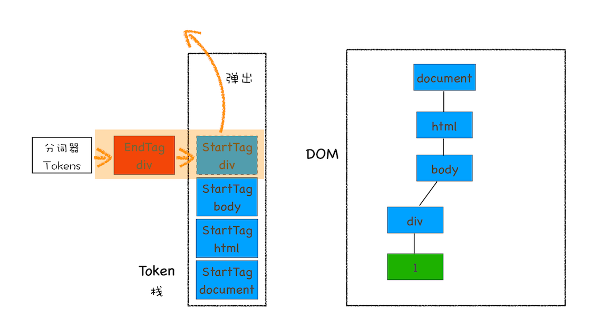
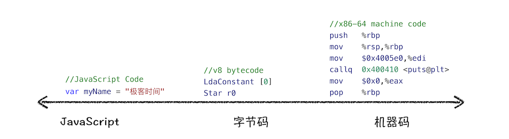
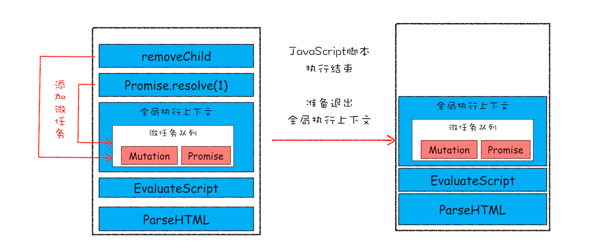
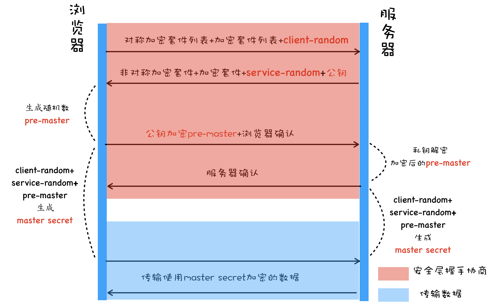

# Chrome浏览器运行机制

## 进程

浏览器最初是单进程架构,但是单进程架构缺点较为明显:

+ 稳定性:
  进程中某个模块的崩溃会导致整个进程的崩溃,比如浏览器的某些插件,或者一些复杂的`JavaScript`代码... ...
+ 流畅性:
  单进程浏览器所有的渲染模块、插件和`JavaScript`执行环境都在同一个线程中,其中一个执行较慢都会影响其他功能的正常运行;
+ 安全性:
  插件通过`C/C++`代码编写可以获取到操作系统的权限,页面的`JavaScript`脚本代码也可以利用浏览器漏洞引发一些安全性问题;

现代浏览器采用了多进程架构:

+ 浏览器主进程:
  主要负责界面显示、用户交互、子进程管理，同时提供存储等功能。
+ 渲染进程:
  > 核心任务是将 `HTML、CSS` 和 `JavaScript` 转换为用户可以与之交互的网页，排版引擎 `Blink` 和 `JavaScript` 引擎 V8 都是运行在该进程中，默认情况下，Chrome 会为每个标签页创建一个渲染进程。出于安全考虑，渲染进程都是运行在沙箱模式下。
+ 网络进程:
  > 主要负责页面的网络资源加载，之前是作为一个模块运行在浏览器进程里面的.
+ GPU进程:
  > Chrome 刚开始发布的时候是没有 GPU 进程的。而 GPU 的使用初衷是为了实现 3D CSS 的效果，只是随后网页、Chrome 的 UI 界面都选择采用 GPU 来绘制，这使得 GPU 成为浏览器普遍的需求。最后，Chrome 在其多进程架构上也引入了 GPU 进程。
+ 插件进程:
  > 主要是负责插件的运行，因插件易崩溃，所以需要通过插件进程来隔离，以保证插件进程崩溃不会对浏览器和页面造成影响。

未来Chrome可能会采用面向服务的架构;

## 缓存机制(cache)

浏览器会对某些资源进行缓存,请求一个网络资源时浏览器会优先查找本地缓存有没有这个资源,如果没有就会再去请求网络资源,如果有就会拦截网络请求从本地返回这个资源并将请求状态码设为`200`.

浏览器对网络资源的缓存方式有两种:

+ 强缓存: 在文件过期之前不再请求服务器, 请求这个资源时会拦截这个请求, 并从本地缓存直接返回,然后浏览器会将这个请求的状态码设为`200`;
+ 协商缓存: 请求时服务端判断这个资源有没有修改过,如果有修改就返回这个资源.如果没有修改就返回`304`状态码,浏览器会使用本地缓存的资源.
+ 缓存的具体方案使用请求头和响应头设置:
  + `Cache-Control`: (响应头)控制网页缓存:
    + `public`: 所有内容都将被缓存（客户端和代理服务器都可缓存）
    + `private`: 所有内容只有客户端可以缓存，`Cache-Control`的默认取值
    + `no-cache`: 客户端缓存内容，但是是否使用缓存则需要经过协商缓存来验证决定
    + `no-store`: 所有内容都不会被缓存，即不使用强制缓存，也不使用协商缓存
    + `max-age=xxx (xxx is numeric)`: 缓存内容将在xxx秒后失效
    + `must-revalidate`: 强制浏览器严格遵守你设置的cache规则
    + `proxy-revalidate`: 强制proxy严格遵守你设置的cache规则
  + `Etag`: (响应头)资源当前版本标识
  + `If-None-Match`: (请求头)本地缓存资源的版本

## 输入URl后发生了什么?

### 导航阶段
  
+ 接收到用户输入后浏览器主进程会触发当前页面的`beforeunload`事件, 然后会判断是搜索内容还是URL:
  + 搜索内容: 浏览器主进程会将搜索内容和默认搜索引擎地址拼接为URl;
  + URL: 浏览器主进程将URL发送给网络进程;
+ 网络进程拿到URL后会查找这个资源有没有缓存:
  + 如果有缓存, 参考缓存流程.
  + 如果没有缓存会发起网络请求.
+ 发起网络请求前需要查找域名IP地址:
  + 本地有缓存这个IP就使用这个IP;
  + 本地没有缓存这个IP会去DNS服务器查找这个IP;
+ 获取到IP之后会去建立TCP链接:(如果是`HTTPS`协议还需要建立`TLS`链接)
  + 三次握手
    + 浏览器发送一个带有`SYN`的数据包;
    + 服务端收到`SYN`数据包后给浏览器发送一个带有`SYN`和`ACK`的数据包;
    + 客户端收到后向服务端发送一个带有`ACK`的数据包;
  + 经过三次握手后链接建立成功,开始传输数据;
  + 传输阶段数据会被分为多个数据包传输, 浏览器接收到一个数据包后会向服务端发送一个确认信息;
  + 服务端在规定时间内没收到接收端反馈的信息会判断数据包丢失,然后会重新发送这个数据包;
+ 网络进程接受到服务器返回的响应头之后判断状态码是不是`301`或者`302`:
  + 是: 会从响应头中的`Location`字段中读取重定向地址,然后重新建立链接;
  + 不是: 根据`Content-Type`判断响应数据的类型,然后根据数据类型的不同采取不同的处理方式;
    + 如果是`application/octet-stream`会将这个请求交给下载进程;
    + 如果是`text/html`就会继续导航流程;
    + 其他类型;
+ 网络进程将响应头交给浏览器主进程;
+ 准备渲染进程,判断是否是需要开启新的渲染进程:
  + 如果是从另一个同站点页面打开的标签页会和这个页面使用同一个渲染进程;
  + 如果是从地址输入或者从一个页面打开的不同站点页面就会开启一个新的渲染进程;
+ 浏览器主进程发送`提交导航`消息到渲染进程;
+ 渲染进程收到`提交导航`消息后和网络进程建立数据管道,然后开始传输数据;
+ 数据传输完成后渲染进程会断开连接并向浏览器主进程发送`确认提交`消息;
  由网络进程判断是否断开链接:
  + 四次挥手断开连接:
    + 浏览器发送一个断开连接的请求,请求中携带`FIN`报文表示请求数据已经发送完;
    + 服务端接收到`FIN`报文后,向浏览器返回一个带有`ACK`的数据包表示已经收到`FIN`报文.这时浏览器在等待服务端传输数据完成;
    + 服务端数据传输完成后, 向浏览器发送一个`FIN`报文.表示服务端数据已传输完成, 可以断开连接;
    + 浏览器收到服务端的`FIN`报文后,向服务端发送一个带有`ACK`的请求.表示收到`FIN`报文, 准备断开连接;
    + 服务端收到`ACK`后断开连接,浏览器不知道服务端是否收到`ACK`会在等待一定时间后再断开连接;
+ 浏览器主进程接收到`确认提交`消息后,开始更新界面状态: 安全状态、地址栏的 URL、前进后退的历史状态, 并更新页面;
+ 渲染进程开始页面解析和子资源加载,进入渲染阶段;

### 渲染阶段

+ 构建DOM树: 浏览器无法直接理解使用`HTML`,所以需要将`HTML`转为浏览器能直接理解的`DOM树`.
  + **HTML 解析器（HTMLParser）**: 它的职责就是负责将 HTML 字节流转换为 DOM 结构, 会默认创建了一个 document节点 的空 DOM 结构作为根节点;
  + HTML 解析器并不是等整个文档加载完成之后再解析的，而是网络进程加载了多少数据，HTML 解析器便解析多少数据。
  + JavaScript加载:
    JavaScript加载和执行都会影响`DOM`的渲染, 可以使用`async` 和 `defer`使`js`文件异步加载;

    >async 和 defer 虽然都是异步的，不过还有一些差异，使用 async 标志的脚本文件一旦加载完成，会立即执行；而使用了 defer 标记的脚本文件，需要在 DOMContentLoaded 事件之前执行。
    \
    > 这里要注意是DOMContentLoaded事件不是load事件，也就是DOM解析完成（并不是所有资源都加载完成）触发DOMContentLoaded事件。
    \
    > 而 JavaScript 引擎在解析 JavaScript 之前，是不知道 JavaScript 是否操纵了 CSSOM 的，所以渲染引擎在遇到 JavaScript 脚本时，不管该脚本是否操纵了 CSSOM，都会执行 CSS 文件下载，解析操作，再执行 JavaScript 脚本。

  + 构建流程:
    + 网络进程收到响应头,根据`content-type`判断文件类型.如果是`text/html`,那么浏览器就会判断这是一个HTML类型的文件;
    + 如果是一个HTML类型的文件,浏览器主进程会选择(`参考上文"同站点"的说明`)或者创建一个渲染进程.
    + 渲染进程准备好以后,网络进程和渲染进程会建立一个共享数据的管道;
    + 网络进程通过这个管道将数据发送给渲染进程,渲染进程拿到数据后交给`HTMLParser`;
    + `HTMLParser`工作流程:
      
      + 第一个阶段，通过分词器将字节流转换为 Token: 分为 `Tag Token` 和`文本 Token`。 `Tag Token` 又分为`StartTag`和`EndTag`, 上述 HTML 代码通过词法分析生成的 Token 如下所示:
      
      + 第二个和第三个阶段是同步进行的，需要将 Token 解析为 DOM 节点，并将 DOM 节点添加到 DOM 树中。
      + HTML 解析器维护了一个 Token 栈结构，该 Token 栈主要用来计算节点之间的父子关系，在第一个阶段中生成的 Token 会被按照顺序压到这个栈中。
        + 如果压入到栈中的是 StartTag Token，HTML 解析器会为该 Token 创建一个 DOM 节点，然后将该节点加入到 DOM 树中，它的父节点就是栈中相邻的那个元素生成的节点。
        + 如果分词器解析出来是文本 Token，那么会生成一个文本节点，然后将该节点加入到 DOM 树中，文本 Token 是不需要压入到栈中，它的父节点就是当前栈顶 Token 所对应的 DOM 节点。
        + 如果分词器解析出来的是 EndTag 标签，比如是 EndTag div，HTML 解析器会查看 Token 栈顶的元素是否是 StarTag div，如果是，就将 StartTag  div 从栈中弹出，表示该 div 元素解析完成。
  + token栈解析过程示意图:
    `解析到<html>标签`
    
    `解析到<div>标签`
    
    `解析到第一个文本标签`
    
    `解析到解析到</div>标签`
    
    `解析完成`
    
+ 样式计算: 为了计算出`DOM节点`中每个元素的具体样式;
  > 和 HTML 一样，渲染引擎也是无法直接理解 CSS 文件内容的，所以需要将其解析成渲染引擎能够理解的结构，这个结构就是 CSSOM。和 DOM 一样，CSSOM 也具有两个作用，第一个是提供给 JavaScript 操作样式表的能力，第二个是为布局树的合成提供基础的样式信息。这个 CSSOM 体现在 DOM 中就是document.styleSheets。
  + 把引入的`css`文件、内联样式、行内样式转化为样式表`styleSheets`;
  + 把样式表中的属性值标准化,比如:
    + 长度单位转为`px`;
    + 颜色值转为`RGB`;
    + 子宽`font-weight`值转为数字;
    ... ...
  + 计算出`DOM树`中每个节点的具体样式: 根据`css`的继承规则和层叠规则计算;
+ 布局:
  + 创建布局树: `DOM树`中有很多不可见的元素, 所以需要构建一个只包含可见元素的布局树.比如:
    + `head`中的标签: `style`, `meta`, `title`, `link`... ...
    + 属性设置为`display: none`的元素;
    ... ...
  + 布局计算: 计算布局树中节点坐标的位置.
    > 在执行布局操作的时候，会把布局运算的结果重新写回布局树中，所以布局树既是输入内容也是输出内容，这是布局阶段一个不合理的地方，因为在布局阶段并没有清晰地将输入内容和输出内容区分开来。针对这个问题，Chrome 团队正在重构布局代码，下一代布局系统叫 LayoutNG，试图更清晰地分离输入和输出，从而让新设计的布局算法更加简单。
+ 分层:
  + 图层树: 为了方便实现层级、动画等效果, 所以渲染引擎需要为特定的节点生成专用的图层, 并将结合图层生成图层树;
  + 会被提升为图层的元素:
    + 拥有层级属性的元素;
    + 需要被裁剪的元素: 元素内容溢出时渲染引擎会裁剪内容的一部分用于显示在元素区域;
+ 绘制图层: 渲染引擎会把图层拆分为很多小的绘制指令,然后再把这些指令按照顺序组成一个待绘制的列表;
+ 分块
  + 绘制列表准备好以后渲染进程的主线程会把列表提交给合成线程;
  + 合成线程会将图层划分为图块,通常尺寸为`256*256`或者`512*512`.
+ 栅格化操作: 使用图块生成位图, 会优先生成视口附近的图块;
  > 通常，栅格化过程都会使用 GPU 来加速生成，使用 GPU 生成位图的过程叫快速栅格化，或者 GPU 栅格化，生成的位图被保存在 GPU 内存中。
+ 合成:
  + 视口附近所有的图块都被栅格化之后, 合成线程会向浏览器主进程提交一个绘制图块的命令`DrawQuad`;
  + 浏览器主进程里有一个`viz`组件用来接收`DrawQuad`命令, 接收到命令以后将页面内容绘制到内存中.
  + 将内存显示到屏幕上;
+ 渲染结束;

`外联css的渲染流程`

`外联js与css的渲染流程`


+ 总结:

> + 第一个阶段，等请求发出去之后，到提交数据阶段，这时页面展示出来的还是之前页面的内容。
> + 第二个阶段，提交数据之后渲染进程会创建一个空白页面，我们通常把这段时间称为解析白屏，并等待 CSS 文件和 JavaScript 文件的加载完成，生成 CSSOM 和 DOM，然后合成布局树，最后还要经过一系列的步骤准备首次渲染。这个阶段的主要问题是白屏时间，如果白屏时间过久，就会影响到用户体验;
> + 第三个阶段，等首次渲染完成之后，就开始进入完整页面的生成阶段了，然后页面会一点点被绘制出来。

+ 白屏时间优化:

> 通过内联 JavaScript、内联 CSS 来移除这两种类型的文件下载，这样获取到 HTML 文件之后就可以直接开始渲染流程了。
但并不是所有的场合都适合内联，那么还可以尽量减少文件大小，比如通过 webpack 等工具移除一些不必要的注释，并压缩 JavaScript 文件。
还可以将一些不需要在解析 HTML 阶段使用的 JavaScript 标记上 async 或者 defer。
对于大的 CSS 文件，可以通过媒体查询属性，将其拆分为多个不同用途的 CSS 文件，这样只有在特定的场景下才会加载特定的 CSS 文件。

### 衍生概念

#### 重排

如果修改了元素的几何属性,比如:宽高.浏览器就会从布局阶段重新开始渲染,这个过程就叫重排;
重排需要更新完整的渲染流程,开销是最大的.

#### 重绘

如果修改了元素的样式属性,如: 背景色, 字体颜色等属性.浏览器就会从绘制图层阶段重新开始渲染, 布局和分层阶段不会被触发.
这个过程就叫重绘.
重绘相比较重排, 效率会更高一些.

#### 合成

如果修改了一个不需要布局和绘制的属性,如: `transform, opacity`等.浏览器就会从合成阶段开始,这个阶段就叫合成.

## JavaScript执行机制

### 内存结构

`JavaScript`中内存空间有三种类型:

+ 堆空间: 用来保存引用类型的值;
  > JavaScript 引擎需要用栈来维护程序执行期间上下文的状态，如果栈空间大了话，所有的数据都存放在栈空间里面，那么会影响到上下文切换的效率，进而又影响到整个程序的执行效率。
+ 栈空间: 用来存储执行上下文;
  + 存储流程:
    + 代码开始运行时会创建一个全局上下文,并压入栈底;
    + 遇到一个函数调用时将这个函数上下文压入栈顶;
    + 当前上下文执行完毕后将指针指向上一个上下文;
  + 闭包:
    JavaScript遇到遇到闭包时会在内部函数的作用域链上添加一个`closure`作用域, 所有被内部函数引用的变量都会保存到`closure`中.
  + 执行上下文中包含:
    + 变量环境: 保存了函数作用域中的变量`var声明的变量`;
    + 词法环境: 保存了块级作用域中的变量`const与let声明的变量`;
    + this: 指向调用者;
    + Outer: 上层执行上下文的指针;
+ 代码空间: 用来执行代码;

### 垃圾回收

+ 调用栈: 当前正在执行的上下文,有一个记录当前执行状态的指针`ESP`.当前上下文执行完毕后,这个指针将移向上一个调用栈.然后再有新的上下文被压入的时候,就会覆盖掉.
+ 堆空间: 堆空间的垃圾回收基于`代际假说`和`分代收集`.
  + 代际假说有两个特点:
    + 第一个是大部分对象在内存中存在的时间很短，简单来说，就是很多对象一经分配内存，很快就变得不可访问;
    + 第二个是不死的对象，会活得更久。
  + 分代收集: 基于代际假说`V8引擎`中将对象分为`新生代`和`老生代`,采取不同的回收策略;
  + 回收策略: 新生代和老生代都采用相同的回收策略:
    + 标记空间中的活动对象和非活动对象;
      + 活动对象: 还在使用的对象;
      + 非活动对象: 没有引用的对象;
    + 回收内存: 统一清理标记位可回收的对象.
    + 整理:
      > 频繁回收对象后,内存中会出现大量不连续空间.这些不连续空间可以称为`内存碎片`,如果需要分配一个较大连续空间的时候可能出现内存不足的情况.所以最后需要整理内存碎片;
    + 新生代: 生存时间短的放入新生代区域, 使用副垃圾回收器回收;
      + >新生代中用 Scavenge 算法来处理。所谓 Scavenge 算法，是把新生代空间对半划分为两个区域，一半是对象区域，一半是空闲区域.
        > 新加入的对象都会放到对象区域,对象区域快被写满时就会执行一次垃圾清理;
        > 因为新生代的垃圾回收比较频繁,所以新生代区域的空间一般不会设置的很大;
        > 因为新生代的空间不大所以很容易就被装满, 所以经过两次垃圾回收还依然存在的对象会被放入老生代中.
      + 在标记完成后,副垃圾回收器就会将活动对象复制到空闲区域中;
      + 在复制时还会把这些对象有序的排列起来, 所以在复制时也同时完成了整理;
      + 在复制完成后,对象区域和空闲区域会进行调换.原来的对象区域变成了空闲区域, 原来的空闲区域变成了对象区域, 这样就完成了回收内存;
    + 老生代: 生存时间长的放入老生代区域, 使用主垃圾回收区回收;
      + > 由于老生区的对象比较大，若要在老生区中使用 Scavenge 算法进行垃圾回收，复制这些大的对象将会花费比较多的时间，从而导致回收执行效率不高，同时还会浪费一半的空间。因而，主垃圾回收器是采用标记 - 清除（Mark-Sweep）的算法进行垃圾回收的。下面我们来看看该算法是如何工作的。
      + 标记过程: 会遍历整个调用栈, 在调用栈中有访问的对象会被标记为`活动对象`.没有被访问的对象就是垃圾数据;
      + 标记-清理: 将不活动的垃圾数据清理;
      + 标记-整理:不过多次清理后会产生大量的`内存碎片`,所以又产生了一种`标记-整理`的算法:
        > 这个标记过程仍然与标记 - 清除算法里的是一样的，但后续步骤不是直接对可回收对象进行清理，而是让所有存活的对象都向一端移动，然后直接清理掉端边界以外的内存。
+ 全停顿: 由于`JavaScript`是运行在渲染进程主线程上的,垃圾回收时需要将正在进行的`JavaScript`脚本停下,等待完成后再恢复执行.这个行为就叫做`全停顿`;
+ 增量标记:
  > 为了降低垃圾回收时因为全停顿造成的卡顿, V8 将标记过程分为一个个的子标记过程，同时让垃圾回收标记和 JavaScript 应用逻辑交替进行，直到标记阶段完成，我们把这个算法称为增量标记（Incremental Marking）算法。
  > 使用增量标记算法，可以把一个完整的垃圾回收任务拆分为很多小的任务，这些小的任务执行时间比较短，可以穿插在其他的 JavaScript 任务中间执行, 就不会让用户因为垃圾回收任务而感受到页面的卡顿了。

### 编译流程

+ 编译性语言:
  > 在编译型语言的编译过程中，编译器首先会依次对源代码进行词法分析、语法分析，生成抽象语法树（AST），然后是优化代码，最后再生成处理器能够理解的机器码。如果编译成功，将会生成一个可执行的文件。但如果编译过程发生了语法或者其他的错误，那么编译器就会抛出异常，最后的二进制文件也不会生成成功。
+ 解释型语言:
  > 在解释型语言的解释过程中，同样解释器也会对源代码进行词法分析、语法分析，并生成抽象语法树（AST），不过它会再基于抽象语法树生成字节码，最后再根据字节码来执行程序、输出结果。

+ V8引擎执行流程:

  

  + 生成抽象语法树（AST）和执行上下文:
  
    ```JavaScript
    var myName = "极客时间"
    function foo(){
      return 23;
    }
    myName = "geektime"
    foo()
    ```

    上面的代码被转换成下面的结构:

    

    > 编译器或者解释器后续的工作都需要依赖于 AST，而不是源代码。  

    生成**AST**需要两个阶段:

    + 分词:
      > 又称为词法分析，其作用是将一行行的源码拆解成一个个 token。所谓 token，指的是语法上不可能再分的、最小的单个字符或字符串。你可以参考下图来更好地理解什么 token。
      > 从图中可以看出，通过var myName = “极客时间”简单地定义了一个变量，其中关键字“var”、标识符“myName” 、赋值运算符“=”、字符串“极客时间”四个都是 token，而且它们代表的属性还不一样。
    + 解析:

      > 又称为语法分析，其作用是将上一步生成的 token 数据，根据语法规则转为 AST。如果源码符合语法规则，这一步就会顺利完成。但如果源码存在语法错误，这一步就会终止，并抛出一个“语法错误”。

  + 有了 AST 后，那接下来 V8 就会生成该段代码的执行上下文。
  + 生成字节码:
    >有了 AST 和执行上下文后，那接下来的第二步，解释器 Ignition 就登场了，它会根据 AST 生成字节码，并解释执行字节码;
    \
    > 其实一开始 V8 并没有字节码，而是直接将 AST 转换为机器码，由于执行机器码的效率是非常高效的，所以这种方式在发布后的一段时间内运行效果是非常好的。但是随着 Chrome 在手机上的广泛普及，特别是运行在 512M 内存的手机上，内存占用问题也暴露出来了，因为 V8 需要消耗大量的内存来存放转换后的机器码。为了解决内存占用问题，V8 团队大幅重构了引擎架构，引入字节码，并且抛弃了之前的编译器，最终花了将进四年的时间，实现了现在的这套架构。
    \
    >字节码就是介于 AST 和机器码之间的一种代码。但是与特定类型的机器码无关，字节码需要通过解释器将其转换为机器码后才能执行。

    

    >从图中可以看出，机器码所占用的空间远远超过了字节码，所以使用字节码可以减少系统的内存使用。

  + 执行代码:
    > 生成字节码之后，接下来就要进入执行阶段了。
    \
    > 通常，如果有一段第一次执行的字节码，解释器 Ignition 会逐条解释执行。到了这里，相信你已经发现了，解释器 Ignition 除了负责生成字节码之外，它还有另外一个作用，就是解释执行字节码。在 Ignition 执行字节码的过程中，如果发现有热点代码（HotSpot），比如一段代码被重复执行多次，这种就称为热点代码，那么后台的编译器 TurboFan 就会把该段热点的字节码编译为高效的机器码，然后当再次执行这段被优化的代码时，只需要执行编译后的机器码就可以了，这样就大大提升了代码的执行效率。
    \
    > 其实字节码配合解释器和编译器是最近一段时间很火的技术，比如 Java 和 Python 的虚拟机也都是基于这种技术实现的，我们把这种技术称为即时编译（JIT）。具体到 V8，就是指解释器 Ignition 在解释执行字节码的同时，收集代码信息，当它发现某一部分代码变热了之后，TurboFan 编译器便闪亮登场，把热点的字节码转换为机器码，并把转换后的机器码保存起来，以备下次使用。

### 消息队列与事件循环


> 从上图可以看出，渲染主线程会频繁接收到来自于 IO 线程的一些任务，接收到这些任务之后，渲染进程就需要着手处理，比如接收到资源加载完成的消息后，渲染进程就要着手进行 DOM 解析了；接收到鼠标点击的消息后，渲染主线程就要开始执行相应的 JavaScript 脚本来处理该点击事件。

`Chrome`浏览器采用消息队列来处理渲染进程接收到的任务;


> 从图中可以看出，消息队列是一种数据结构，可以存放要执行的任务。它符合队列“先进先出”的特点，也就是说要添加任务的话，添加到队列的尾部；要取出任务的话，从队列头部去取。

渲染进程主线程执行的任务从消息队列中获取, 渲染进程其他线程需要渲染进程主线程执行任务只需要将任务添加到消息队列中;

渲染进程中还有个`IO`线程,用来接收其他进程需要执行的任务.`IO`线程接收到任务后再发送给渲染进程主线程;

>由于是多个线程操作同一个消息队列，所以在添加任务和取出任务时还会加上一个同步锁。


渲染进程是执行任务流程如上图所示, 渲染进程主线程会不断的查询消息队列.然后从消息队列头部取出任务执行,执行完以后再接着查询消息队列取出头部任务执行.这个过程就叫做事件循环.

页面线程所有执行的任务都来自于消息队列。消息队列是“先进先出”的属性，也就是说放入队列中的任务，需要等待前面的任务被执行完，才会被执行。鉴于这个属性，就有如下两个问题需要解决:

+ 如何处理高优先级的任务?

> 一个典型的场景是监控 DOM 节点的变化情况（节点的插入、修改、删除等动态变化），然后根据这些变化来处理相应的业务逻辑。一个通用的设计的是，利用 JavaScript 设计一套监听接口，当变化发生时，渲染引擎同步调用这些接口，这是一个典型的观察者模式。
\
>不过这个模式有个问题，因为 DOM 变化非常频繁，如果每次发生变化的时候，都直接调用相应的 JavaScript 接口，那么这个当前的任务执行时间会被拉长，从而导致执行效率的下降。
\
> 如果将这些 DOM 变化做成异步的消息事件，添加到消息队列的尾部，那么又会影响到监控的实时性，因为在添加到消息队列的过程中，可能前面就有很多任务在排队了。
\
> 这也就是说，如果 DOM 发生变化，采用同步通知的方式，会影响当前任务的执行效率；如果采用异步方式，又会影响到监控的实时性。

`Chrome`采用微任务解决这个问题:

> 通常我们把消息队列中的任务称为宏任务，每个宏任务中都包含了一个微任务队列，在执行宏任务的过程中，如果 DOM 有变化，那么就会将该变化添加到微任务列表中，这样就不会影响到宏任务的继续执行，因此也就解决了执行效率的问题。

`微任务中同样也包括promise和node中的nextTick等任务.`

+ 是如何解决单个任务执行时长过久的问题?

> 因为所有的任务都是在单线程中执行的，所以每次只能执行一个任务，而其他任务就都处于等待状态。如果其中一个任务执行时间过久，那么下一个任务就要等待很长时间。可以参考下图：


> 从图中你可以看到，如果在执行动画过程中，其中有个 JavaScript 任务因执行时间过久，占用了动画单帧的时间，这样会给用户制造了卡顿的感觉，这当然是极不好的用户体验。针对这种情况，JavaScript 可以通过回调功能来规避这种问题，也就是让要执行的 JavaScript 任务滞后执行。

#### 延时队列

> 在 Chrome 中除了正常使用的消息队列之外，还有另外一个消息队列，这个队列中维护了需要延迟执行的任务列表，包括了定时器和 Chromium 内部一些需要延迟执行的任务。所以当通过 JavaScript 创建一个定时器时，渲染进程会将该定时器的回调任务添加到延迟队列中。

在处理完消息队列中一个任务后就开始执行一个`ProcessDelayTask`函数,这个函数是专门用来处理延迟任务的;
`ProcessDelayTask`函数根据发起时间和延迟时间计算出到期的任务,然后依次执行这些到期的任务;
取消定时器就是删除延迟队列中的任务:

根据定时器返回的ID从延迟队列中找到对应的任务,然后再从队列中删除掉;

定时器中的注意事项:

+ 定时器默认执行时间是300毫秒;
+ 同步任务会阻塞定时器的执行,可能执行时间会比预计时间要长;
+ 定时器嵌套调用超过五层,后面每次调用事假最小间隔是4毫秒.原因是定时器嵌套调用五次以上浏览器会判断这个方法被阻塞了,定时器调用时间间隔小于4毫秒时,浏览器会将每次调用的时间间隔设为4毫秒;
+ 未激活的页面,定时器执行的最小间隔是1000毫秒;
+ 定时器延时最大值为2147483647毫秒,约24.8天.
  超出这个值就会溢出,相当于设置为0;
  原因是Chrome、Safari、Firefox 都是以 32 个 bit 来存储延时值的，32bit 最大只能存放的数字是 2147483647;
+ 定时器中this指向:

```JavaScript
  var name= 1;
  var MyObj = {
    name: 2,
    showName: function(){
      console.log(this.name);
    }
  }
  setTimeout(MyObj.showName,1000);
  ```

  这里输出的是 1，因为这段代码在编译的时候，执行上下文中的 this 会被设置为全局 window，如果是严格模式，会被设置为 undefined。

  所以应当将方法调用放入匿名函数或者使用`bind`方法重新绑定;

#### 事件件循环流程

+ 宏任务: 宏任务就是消息队列中的任务;
  + 先从多个消息队列中选出一个最老的任务，这个任务称为 oldestTask；
  + 然后循环系统记录任务开始执行的时间，并把这个 oldestTask 设置为当前正在执行的任务；
  + 当任务执行完成之后，删除当前正在执行的任务，并从对应的消息队列中删除掉这个 oldestTask；
  + 最后统计执行完成的时长等信息。
+ 微任务: 微任务就是一个需要异步执行的函数，执行时机是在主函数执行结束之后、当前宏任务结束之前。
  > JavaScript 执行一段脚本的时候，V8 会为其创建一个全局执行上下文，在创建全局执行上下文的同时，V8 引擎也会在内部创建一个微任务队列。
  >不过这个微任务队列是给 V8 引擎内部使用的，所以无法通过 JavaScript 直接访问的.

  当宏任务执行时, 遇到的微任务都会添加到这个宏任务的微任务队列中:
  
  微任务的执行是在当前宏任务中的`JavaScript`执行完成后, 退出全局上下文的时候`JavaScript`引擎回去检查全局执行上下文中的微任务,然后按照顺序执行队列中的微任务:
  
  **WHATWG 把执行微任务的时间点称为检查点。**

  > 如果在执行微任务的过程中，产生了新的微任务，同样会将该微任务添加到微任务队列中，V8 引擎一直循环执行微任务队列中的任务，直到队列为空才算执行结束。也就是说在执行微任务过程中产生的新的微任务并不会推迟到下个宏任务中执行，而是在当前的宏任务中继续执行。

### 回调函数

+ 同步回调:
  
  ```JavaScript
  let callback = function(){
      console.log('i am do homework')
  }
  function doWork(cb) {
      console.log('start do work')
      cb()
      console.log('end do work')
  }
  doWork(callback)
  ```

  上面的回调方法有个特点，就是回调函数 callback 是在主函数 doWork 返回之前执行的，我们把这个回调过程称为同步回调。
+ 异步回调:

  ```JavaScript
  let callback = function(){
      console.log('i am do homework')
  }
  function doWork(cb) {
      console.log('start do work')
      setTimeout(cb,1000)   
      console.log('end do work')
  }
  doWork(callback)
  ```
  
  在这个例子中，我们使用了 setTimeout 函数让 callback 在 doWork 函数执行结束后，又延时了 1 秒再执行，这次 callback 并没有在主函数 doWork 内部被调用，我们把这种回调函数在主函数外部执行的过程称为异步回调。

  异步回调的执行方式有两种:

  + 第一种是把异步回调函数封装成一个宏任务，添加到消息队列尾部，当循环系统执行到该任务的时候执行回调函数。如: `setTimeout`, `XMLHttpRequest`等;
  + 第二种方式的执行时机是在主函数执行结束之后、当前宏任务结束之前执行回调函数，这通常都是以微任务形式体现的。如: `Promise`等.

### 浏览器安全

#### 同源策略

如果两个 URL 的协议、域名和端口都相同，我们就称这两个 URL 同源。

同源策略主要表现在DOM, Web数据和网络三个层面:

> 第一个，DOM 层面。同源策略限制了来自不同源的 JavaScript 脚本对当前 DOM 对象读和写的操作。
第二个，数据层面。同源策略限制了不同源的站点读取当前站点的 Cookie、IndexDB、LocalStorage 等数据。由于同源策略，我们依然无法通过第二个页面的 opener 来访问第一个页面中的 Cookie、IndexDB 或者 LocalStorage 等内容。
第三个，网络层面。同源策略限制了通过 XMLHttpRequest 等方式将站点的数据发送给不同源的站点。

web是一个开放的平台,应当可以接受第三方资源.
所以同源策略允许引用外部的资源;

如果站点的服务器与站点不同源, 这样也会制约我们的生产力.所以引入了``跨域资源共享（CORS）``;

如果两个页面是不同源的, 这个时候无法相互操作`DOM`;但是又存在一些需要跨域操作`DOM`的需求, 所以又引入了`跨文档消息机制`.可以通过`window.postMessage`和不同源的`DOM`通信.

#### XSS

> XSS 全称是 Cross Site Scripting，为了与“CSS”区分开来，故简称 XSS，翻译过来就是“跨站脚本”。XSS 攻击是指黑客往 HTML 文件中或者 DOM 中注入恶意脚本，从而在用户浏览页面时利用注入的恶意脚本对用户实施攻击的一种手段。
最开始的时候，这种攻击是通过跨域来实现的，所以叫“跨域脚本”。但是发展到现在，往 HTML 文件中注入恶意代码的方式越来越多了，所以是否跨域注入脚本已经不是唯一的注入手段了，但是 XSS 这个名字却一直保留至今。
当页面被注入了恶意 JavaScript 脚本时，浏览器无法区分这些脚本是被恶意注入的还是正常的页面内容，所以恶意注入 JavaScript 脚本也拥有所有的脚本权限。这些脚本可以做一些恶意的操作:
\
可以窃取 Cookie 信息。恶意 JavaScript 可以通过“document.cookie”获取 Cookie 信息，然后通过 XMLHttpRequest 或者 Fetch 加上 CORS 功能将数据发送给恶意服务器；恶意服务器拿到用户的 Cookie 信息之后，就可以在其他电脑上模拟用户的登录，然后进行转账等操作。
\
可以监听用户行为。恶意 JavaScript 可以使用“addEventListener”接口来监听键盘事件，比如可以获取用户输入的信用卡等信息，将其发送到恶意服务器。黑客掌握了这些信息之后，又可以做很多违法的事情。
\
可以通过修改 DOM 伪造假的登录窗口，用来欺骗用户输入用户名和密码等信息。
\
还可以在页面内生成浮窗广告，这些广告会严重地影响用户体验。

恶意脚本注入方式:

+ 存储型 XSS 攻击


+ 反射型 XSS 攻击

  > 在一个反射型 XSS 攻击过程中，恶意 JavaScript 脚本属于用户发送给网站请求中的一部分，随后网站又把恶意 JavaScript 脚本返回给用户。当恶意 JavaScript 脚本在用户页面中被执行时，黑客就可以利用该脚本做一些恶意操作。
+ 基于 DOM 的 XSS 攻击
  > 基于 DOM 的 XSS 攻击是不牵涉到页面 Web 服务器的。具体来讲，黑客通过各种手段将恶意脚本注入用户的页面中，比如通过网络劫持在页面传输过程中修改 HTML 页面的内容，这种劫持类型很多，有通过 WiFi 路由器劫持的，有通过本地恶意软件来劫持的，它们的共同点是在 Web 资源传输过程或者在用户使用页面的过程中修改 Web 页面的数据。

阻止XSS的方式:

+ 服务器对输入脚本进行过滤或转码
+ 充分利用 CSP:
  + CSP: 内容安全策略
    > 开发者明确告诉客户端（制定比较严格的策略和规则），哪些外部资源是可以加载和执行的 ，即使攻击者发现漏洞，但是它是没办法注入脚本的
+ 使用 HttpOnly 属性: 由于很多 XSS 攻击都是来盗用 Cookie 的，因此还可以通过使用 HttpOnly 属性来保护我们 Cookie 的安全。

#### CSRF

> CSRF 英文全称是 Cross-site request forgery，所以又称为“跨站请求伪造”，是指黑客引诱用户打开黑客的网站，在黑客的网站中，利用用户的登录状态发起的跨站请求。简单来讲，CSRF 攻击就是黑客利用了用户的登录状态，并通过第三方的站点来做一些坏事。

CSRF实现方式:

+ 自动发起 Get 请求;

  ```HTML
    <!DOCTYPE html>
    <html>
      <body>
        <h1>黑客的站点：CSRF攻击演示</h1>
        
      </body>
    </html>
  ```

  > 这是黑客页面的 HTML 代码，在这段代码中，黑客将转账的请求接口隐藏在 img 标签内，欺骗浏览器这是一张图片资源。当该页面被加载时，浏览器会自动发起 img 的资源请求，如果服务器没有对该请求做判断的话，那么服务器就会认为该请求是一个转账请求
+ 自动发起 POST 请求

  ```HTML
  <!DOCTYPE html>
  <html>
  <body>
    <h1>黑客的站点：CSRF攻击演示</h1>
    <form id='hacker-form' action="https://www.ex.org/sendcoin" method=POST>
      <input type="hidden" name="user" value="hacker" />
      <input type="hidden" name="number" value="100" />
    </form>
    <script> document.getElementById('hacker-form').submit(); </script>
  </body>
  </html>
  ```
  
  > 在这段代码中，我们可以看到黑客在他的页面中构建了一个隐藏的表单，该表单的内容就是极客时间的转账接口。当用户打开该站点之后，这个表单会被自动执行提交；当表单被提交之后，服务器就会执行转账操作。因此使用构建自动提交表单这种方式，就可以自动实现跨站点 POST 数据提交。

+ 引诱用户点击链接
  
  ```HTML
  <div>
     </img> </div> <div>
    <a href="https://time.geekbang.org/sendcoin?user=hacker&number=100" taget="_blank">
      点击下载美女照片
    </a>
  </div>
  ```

  > 这段黑客站点代码，页面上放了一张美女图片，下面放了图片下载地址，而这个下载地址实际上是黑客用来转账的接口，一旦用户点击了这个链接，那么他就会向黑客的账户转账。

CORF攻击还需要一些前提条件:

+ 第一个，目标站点一定要有 CSRF 漏洞；
  `比如使用Cookie.`
+ 第二个，用户要登录过目标站点，并且在浏览器上保持有该站点的登录状态；
  `本地保存有Cookie信息;`
+ 第三个，需要用户打开一个第三方站点，可以是黑客的站点，也可以是一些论坛。
  `诱导用户操作`

服务器避免CSRF攻击的方式:

+ 利用Cookie 的 SameSite 属性,禁止第三方站点发送请求;
+ 验证请求的来源站点, 判断是不是自己的站点;可以通过请求头中的`Origin`属性判断;
+ CSRF Token:
  + 第一步，在浏览器向服务器发起请求时，服务器生成一个 CSRF Token。CSRF Token 其实就是服务器生成的字符串，然后将该字符串植入到返回的页面中。
  + 第二步，在浏览器端如果要发起敏感的请求，那么需要带上页面中的 CSRF Token，然后服务器会验证该 Token 是否合法。

#### 安全沙箱

> 浏览器本身的漏洞是单进程浏览器的一个主要问题，如果浏览器被曝出存在漏洞，那么在这些漏洞没有被及时修复的情况下，黑客就有可能通过恶意的页面向浏览器中注入恶意程序，其中最常见的攻击方式是利用缓冲区溢出，不过需要注意这种类型的攻击和 XSS 注入的脚本是不一样的。
\
> XSS 攻击只是将恶意的 JavaScript 脚本注入到页面中，虽然能窃取一些 Cookie 相关的数据，但是 XSS 无法对操作系统进行攻击。
而通过浏览器漏洞进行的攻击是可以入侵到浏览器进程内部的，可以读取和修改浏览器进程内部的任意内容，还可以穿透浏览器，在用户的操作系统上悄悄地安装恶意软件、监听用户键盘输入信息以及读取用户硬盘上的文件内容。

多进程浏览器通过安全沙箱来隔离渲染进程:


浏览器被划分为浏览器内核和渲染内核, 其中渲染内核被安全沙箱单独隔离.
使渲染内核无法获取系统权限,操作系统文件.
渲染内核想要调用系统的功能都要通过浏览器内核来实现, 浏览器内核可以过滤掉接收到的非法指令.


比如js文件中, js脚本想要调取文件读取功能: 渲染进程就需要通过浏览器内核来实现;

#### HTTPS

因为HTTP是明文传输的,所以在传输过程中可能会被窃取或篡改.这种攻击方式被称为`中间人攻击`;
为了信息的安全, 引入了`HTTPS`加密数据;
`HTTPS`相对于`HTTP`增加了一个安全层, 数据在发送接受的过程中都会经过安全层.


> 从图中我们可以看出 HTTPS 并非是一个新的协议，通常 HTTP 直接和 TCP 通信，HTTPS 则先和安全层通信，然后安全层再和 TCP 层通信。也就是说 HTTPS 所有的安全核心都在安全层，它不会影响到上面的 HTTP 协议，也不会影响到下面的 TCP/IP.
安全层有两个主要的职责：对发起 HTTP 请求的数据进行加密操作和对接收到 HTTP 的内容进行解密操作。

#### 加密方法

+ 使用对称加密传输数据: 因为加密套件和秘钥也经过`HTTP`传输.所以单独使用对称加密也是不安全的;


+ 使用非对称加密传输数据: 解决了黑客获取到客户端发送数据的安全问题, 但是无法保证服务端数据的安全, 并且非对称加密效率较低影响了加密解密速度.

  > 第一个是非对称加密的效率太低。这会严重影响到加解密数据的速度，进而影响到用户打开页面的速度。
  第二个是无法保证服务器发送给浏览器的数据安全。虽然浏览器端可以使用公钥来加密，但是服务器端只能采用私钥来加密，私钥加密只有公钥能解密，但黑客也是可以获取得到公钥的，这样就不能保证服务器端数据的安全了。

  

+ 使用对称加密与非对称加密结合: 在传输数据阶段依然使用对称加密，但是对称加密的密钥我们采用非对称加密来传输。

  >首先浏览器向服务器发送对称加密套件列表、非对称加密套件列表和随机数 client-random；
  服务器保存随机数 client-random，选择对称加密和非对称加密的套件，然后生成随机数 service-random，向浏览器发送选择的加密套件、service-random 和公钥；
  浏览器保存公钥，并生成随机数 pre-master，然后利用公钥对 pre-master 加密，并向服务器发送加密后的数据；
  最后服务器拿出自己的私钥，解密出 pre-master 数据，并返回确认消息。
  \
  pre-master 是经过公钥加密之后传输的，所以黑客无法获取到 pre-master，这样黑客就无法生成密钥，也就保证了黑客无法破解传输过程中的数据了。
  \
  到此为止，服务器和浏览器就有了共同的 client-random、service-random 和 pre-master，然后服务器和浏览器会使用这三组随机数生成对称密钥，因为服务器和浏览器使用同一套方法来生成密钥，所以最终生成的密钥也是相同的

  

  但是这种方法无法防范`DNS`劫持, 如果域名被劫持后访问的其实是黑客的服务器了, 黑客就可以在自己的服务器上实现公钥和私钥.

+ 使用对称加密与非对称加密结合并添加数字证书: 通过数字证书验证服务器的真实性;

  > 有了 CA 签名过的数字证书，当浏览器向极客时间服务器发出请求时，服务器会返回数字证书给浏览器。
  浏览器接收到数字证书之后，会对数字证书进行验证。
  首先浏览器读取证书中相关的明文信息，采用 CA 签名时相同的 Hash 函数来计算并得到信息摘要 A；
  然后再利用对应 CA 的公钥解密签名数据，得到信息摘要 B；
  对比信息摘要 A 和信息摘要 B，如果一致，则可以确认证书是合法的，即证明了这个服务器是合法服务器的；
  同时浏览器还会验证证书相关的域名信息、有效时间等信息。这时候相当于验证了 CA 是谁，但是这个 CA 可能比较小众，浏览器不知道该不该信任它，然后浏览器会继续查找给这个 CA 颁发证书的 CA，再以同样的方式验证它上级 CA 的可靠性。
  通常情况下，操作系统中会内置信任的顶级 CA 的证书信息（包含公钥），如果这个 CA 链中没有找到浏览器内置的顶级的 CA，证书也会被判定非法。
