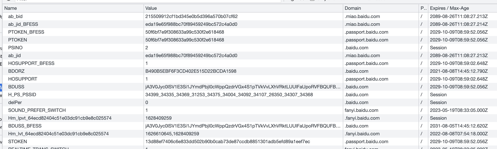
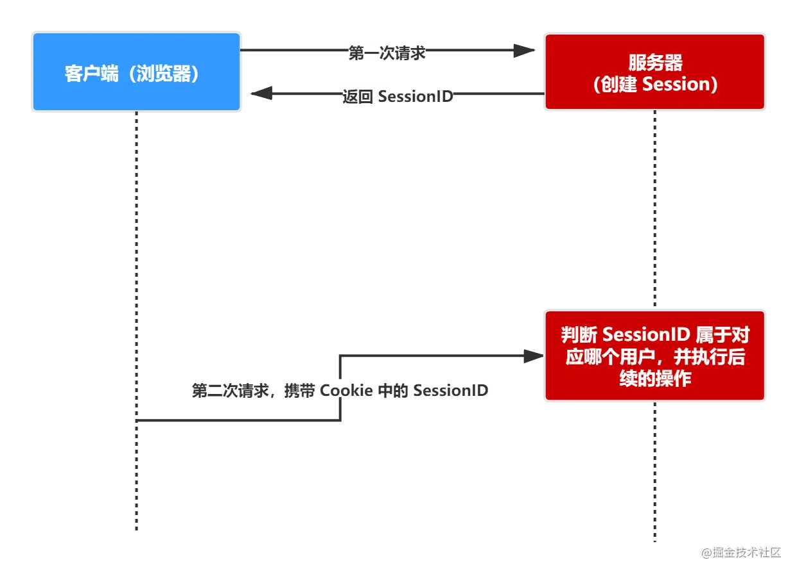

# Cookie

> HTTP 是无状态协议，它不对之前发生过的请求和响应的状态进行管理。也就是说，无法根据之前的状态进行本次的请求处理。
\
不可否认，无状态协议当然也有它的优点。由于不必保存状态，自然可减少服务器的 CPU 及内存资源的消耗。从另一侧面来说，也正是因为 HTTP 协议本身是非常简单的，所以才会被应用在各种场景里。
\
保留无状态协议这个特征的同时又要解决类似的矛盾问题，于是引入了 Cookie 技术。Cookie 技术通过在请求和响应报文中写入 Cookie 信息来控制客户端的状态。

Cookie本身是一个很小的文件,是浏览器存储的状态信息.
每次请求的时候都会发送对应的站点的Cookie用来给服务器判断用户的状态,通常都会用作登录状态的判断.

## Cookie的分类

+ 会话cookie: 会话cookie是指在不设定它的生命周期`expires`时的状态，前面说了，浏览器的开启到关闭就是一次会话，当关闭浏览器时，会话cookie就会跟随浏览器而销毁。当关闭一个页面时，不影响会话cookie的销毁。
+ 持久cookie: 持久cookie是设定了它的生命周期expires, 关闭浏览器之后，它不会销毁，直到设定的过期时间.

## Cookie的属性

+ name: 当前cookie的名称;
+ value; 当前cookie的值;
+ domain: 指的是可以访问当前Cookie的域名,如果不设置默认为当前会话的域名;
+ path: 匹配可以访问当前Cookie的路径, 默认为`/`. 因为是匹配的路径, 所以并不是要求路径完全相等.
+ Expires/Max-Age: 当前Cookie的失效时间;
  + Expires: 值为一个未来的时间点, 如: 2023-08-08T06:45:36.000Z;
  + Max-Age: 值为数字, 以秒为单位.
    + 值为负数的时候,表示是临时存储,不会生成cookie文件. 存储在内存中,当窗口关闭时就会被清除;
    + 值为正数时, 表示是cookie存在的时长,过期后就会被删除.
    + 值为`0`时, 会直接被删除.
+ secure: 指的是安全性,当设置为`true`时就只会在安全模式下传输.
+ HttpOnly: 这个属性是面试的时候常考的，如果这个属性设置为true，就不能通过js脚本来获取cookie的值;
+ SameSite: 可以让cookie在跨站请求时不会被发送, 用来解决**CSRF**攻击.值有下面三种:
  + Strict: 仅允许一方请求携带 Cookie，即浏览器将只发送相同站点请求的 Cookie，即当前网页 URL 与请求目标 URL 完全一致。
  + Lax: 允许部分第三方请求携带 Cookie
  + None 无论是否跨站都会发送 Cookie

## 操作Cookie

+ js操作: 通过`document.cookie`可以读取或者修改值.
+ 服务端操作: 通过响应头中的`Set-Cookie`设置cookie.

## cookie的不可跨域性

cookie只能在同域名,或者次级域名使用;

+ 域名不相同不能使用, `相同`指的是全部相同, 如: `miao.baidu.com`与`passport.baidu.com`、`baidu.com`尽管都属于`baidu.com`, 但是也都是不同的.
+ 在次级域名使用: 主域名下的cookie可以被次一级的域名使用, 如: `baidu.com`下的cookie可以被`miao.baidu.com`与`passport.baidu.com`使用, 但是不能被再下一级的域名使用, 比如`a.miao.baidu.com`.

## cookie的使用

cookie通常和session配合使用做登录验证:

+ 用户第一次请求服务器的时候，服务器根据用户提交的相关信息，创建对应的 Session
+ 请求返回时将此 Session 的唯一标识信息 SessionID 返回给浏览器
+ 浏览器接收到服务器返回的 SessionID 信息后，会将此信息存入到 Cookie 中，同时 + Cookie 记录此 SessionID 属于哪个域名
+ 当用户第二次访问服务器的时候，请求会自动判断此域名下是否存在 Cookie 信息，如果存在自动将 Cookie 信息也发送给服务端，服务端会从 Cookie 中获取 SessionID，再根据 SessionID 查找对应的 Session 信息，如果没有找到说明用户没有登录或者登录失效，如果找到 Session 证明用户已经登录可执行后面操作。
