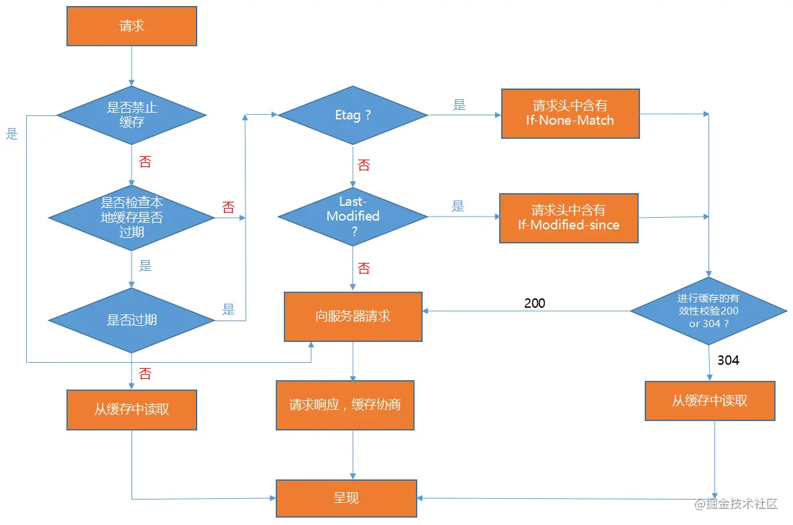

# HTTP缓存

## 缓存类型

+ 强缓存: 获取文件时, 在文件过期前不请求服务端, 而是在本地缓存中读取;
+ 协商缓存: 获取文件时, 会请求服务端, 服务端判断文件有没有修改. 如果修改了就返回文件, 如果没有修改就返回`304`状态码, 然后浏览器读取本地文件.

## 头部字段说明

+ HTTP/1.0:
  + **Pragma**: 通用头;
    Pragma 只有一个属性值，就是 no-cache: 不使用强缓存, 使用协商缓存.
  + **Expires**: 响应头;
    Expires的值是服务器告诉浏览器的缓存过期时间（值为GMT时间，即格林尼治时间），即下一次请求时，如果浏览器端的当前时间还没有到达过期时间，则直接使用缓存数据。
  + **Last-Modified**: 响应头;
    浏览器和服务器协商，服务器每次返回文件的同时，告诉浏览器文件在服务器上最近的修改时间。
  + **If-Modified-Since**: 请求头;
    等于上一次请求所响应的`Last-Modified`;
+ HTTP/1.1:
  + **Cache-Control**: 通用头;
    针对浏览器和服务器时间不同步，加入的新的缓存方案, 用来设置缓存策略.
    可以设置多个参数, 参数如下:
    + **max-age**：单位是秒，缓存时间计算的方式是距离发起的时间的秒数，超过间隔的秒数缓存失效
    + **no-cache**：不使用强缓存，使用协商缓存;
    + **no-store**：禁止使用缓存（包括协商缓存），每次都向服务器请求最新的资源
    + **private**：专用于个人的缓存，中间代理、CDN 不能缓存此响应
    + **public**：响应可以被中间代理、CDN 等缓存
    + **must-revalidate**：在缓存过期前可以使用，过期后必须向服务器验证
  + **ETag**: 响应头
    为了解决协商缓存中文件修改时间不精确带来的问题，服务器和浏览器再次协商，这次不返回时间，返回文件的唯一标识ETag。
  + **If-None-Match**: 请求头;
    等于上次请求时响应的`ETag`;
  + **Date**: 通用头;
    包含了报文创建的日期和时间;

## 缓存策略

1. 是否禁止缓存: 使用**Cache-Control**与**Pragma**判断;
2. 是否检查本地副本是否过期: 由**Cache-Contro** 的 `no-cache`和`must-revalidate`控制.
3. 本地副本是否过期`(强缓存)`:
    1. 优先判断**Cache-Control**: `max-age=<seconds>`是否过期.
    2. 如果不含有**max-age**属性，则会去查看是否包含**Expires**属性，通过比较**Expires**的值和头里面**Date**属性的值来判断是否缓存还有效。
    3. 如果 **max-age** 和 **expires** 属性都没有，找找头里的 **Last-Modified** 信息。如果有，缓存的寿命就等于头里面 **Date**的值减去**Last-Modified**的值**除以10**.
4. 如果本地副本没有过期: 直接从缓存中读取资源，并返回200状态码。
5. 如果本地副本过期: 会进行到源服务器进行有效性校验的前期准备.
    1. 在请求头里寻找If-None-Match字段.
    2. 如果请求头里没有If-None-Match字段，则会在请求头中寻找If-Modified-Since字段.
    3. 如果If-None-Match与If-Modified-Since都没有，则会直接向服务器请求数据.
6. 到源服务器进行有效性校验`(协商缓存)`: 如果请求头中带有**If-None-Match**或**If-Modified-Since**，则会到源服务器进行有效性校验，如果源服务器资源没有变化，会返回`304`, 如果有变化，就返回`200`;
