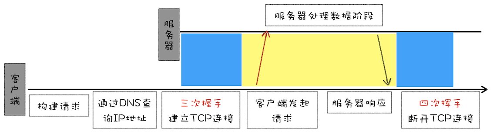
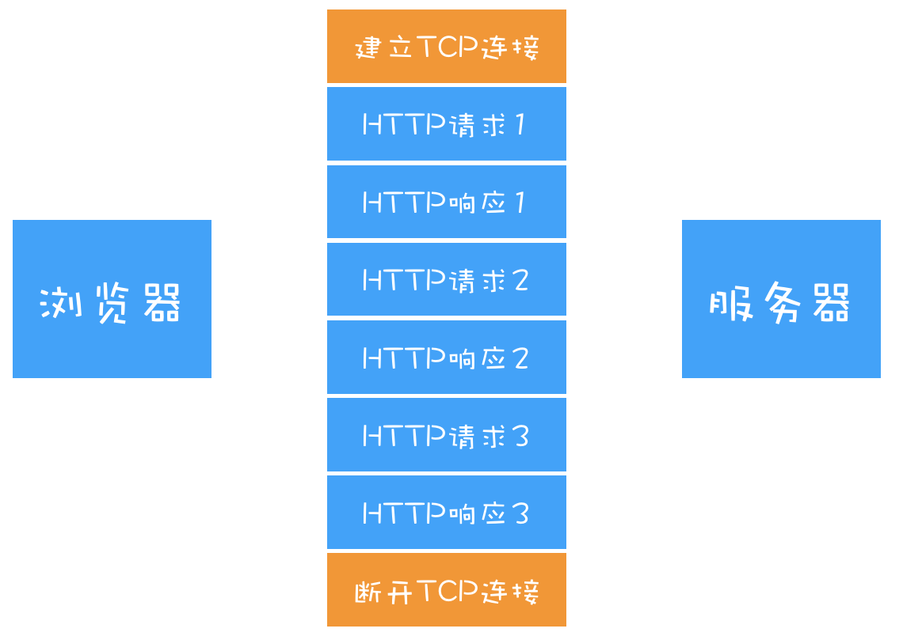

# HTTP各版本差异

## 0.9

> HTTP/0.9 是于 1991 年提出的，主要用于学术交流，需求很简单——用来在网络之间传递 HTML 超文本的内容，所以被称为超文本传输协议。

HTTP/0.9仅仅用来传输体积很小的`HTML`, 所以有三个特点:

+ 第一个是只有一个请求行，并没有 HTTP 请求头和请求体，因为只需要一个请求行就可以完整表达客户端的需求了。
+ 第二个是服务器也没有返回头信息，这是因为服务器端并不需要告诉客户端太多信息，只需要返回数据就可以了。
+ 第三个是返回的文件内容是以 ASCII 字符流来传输的，因为都是 HTML 格式的文件，所以使用 ASCII 字节码来传输是最合适的。

`http/0.9流程`

## 1.0

随着网络的发展, 浏览器还需要展示`JavaScript`, 图片, 视频, 音频等多种类型的文件.所以`HTTP/1.0`也支持了多种类型文件的传输:

> HTTP/1.0 引入了请求头和响应头，它们都是以为 Key-Value 形式保存的，在 HTTP 发送请求时，会带上请求头信息, 服务器返回数据时，会先返回响应头信息。

除了请求头响应头之外, `HTTP/1.0`还引入了状态码、缓存机制.

`http/1.0流程`

## 1.1

### 持久连接

由于`HTTP/1.0`中每次请求都要建立`TCP`链接, 当存在大量资源的时候会增加很多开销.
所以`HTTP/1.1`添加了持久连接, 可以在一个`TCP`连接上传输多个`HTTP`请求.

`HTTP/1.0短连接`

`HTTP/1.1长连接`

### 虚拟主机

随着虚拟主机的发展, 需要实现在一台物理机上绑定多个虚拟机, 每个虚拟机都有自己单独的域名, 这些域名都共用一个IP地址.
所以`HTTP/1.1`中新增了`Host`字段, 用来表示当前请求的域名地址.

### 动态内容

> 在设计 HTTP/1.0 时，需要在响应头中设置完整的数据大小，如Content-Length: 901，这样浏览器就可以根据设置的数据大小来接收数据。不过随着服务器端的技术发展，很多页面的内容都是动态生成的，因此在传输数据之前并不知道最终的数据大小，这就导致了浏览器不知道何时会接收完所有的文件数据。
\
HTTP/1.1 通过引入 Chunk transfer 机制来解决这个问题，服务器会将数据分割成若干个任意大小的数据块，每个数据块发送时会附上上个数据块的长度，最后使用一个零长度的块作为发送数据完成的标志。这样就提供了对动态内容的支持。

### Cookie

> HTTP/1.1 还引入了客户端 Cookie 机制和安全机制;

### HTTP1.1的缺点

HTTP/1.1对带宽的利用率并不理想, 主要原因是因为:

+ TCP慢启动: 是为了减少网络拥挤的一种策略:

  > 一旦一个 TCP 连接建立之后，就进入了发送数据状态，刚开始 TCP 协议会采用一个非常慢的速度去发送数据，然后慢慢加快发送数据的速度，直到发送数据的速度达到一个理想状态，我们把这个过程称为慢启动。
+ 竞争带宽: 同时开启了多条 TCP 连接，那么这些连接会竞争固定的带宽.
  但是多条 TCP 连接之间又不能协商让哪些关键资源优先下载，这样就有可能影响那些关键资源的下载速度了。
+ 队头阻塞: `HTTP/1.1`公用一个`TCP管道`, 但是一个管道中只能处理一个请求, 在当前的请求没有结束之前，其他的请求只能处于阻塞状态。

## 2.0

为了解决`HTTP/1.1`的问题, `HTTP/2`采用了多路复用:

> HTTP/2 使用了多路复用技术，可以将请求分成一帧一帧的数据去传输，这样带来了一个额外的好处，就是当收到一个优先级高的请求时，比如接收到 JavaScript 或者 CSS 关键资源的请求，服务器可以暂停之前的请求来优先处理关键资源的请求。

一个域名只使用一个 TCP 长连接来传输数据，这样整个页面资源的下载过程只需要一次慢启动，同时也避免了多个 TCP 连接竞争带宽所带来的问题。
使用一个长链接, 还可以避免竞争带宽带来的问题.
为了解决**队头阻塞**问题, `HTTP/2`采用并行请求的方式来解决:
每个请求都有一个对应的 **ID**, 服务器端接收到这些请求后，自行决定优先返回哪些内容.
因为每份数据都有对应的 ID，浏览器接收到之后，会筛选出相同 ID 的内容，将其拼接为完整的 HTTP 响应数据.

为了实现多路复用`HTTP/2`添加了一个**二进制分帧层**: 所有请求响应的数据都会通过这个**二进制分帧层**处理

1. 首先，浏览器准备好请求数据，包括了请求行、请求头等信息，如果是 POST 方法，那么还要有请求体。
2. 这些数据经过二进制分帧层处理之后，会被转换为一个个带有请求 ID 编号的帧，通过协议栈将这些帧发送给服务器。
3. 服务器接收到所有帧之后，会将所有相同 ID 的帧合并为一条完整的请求信息。
4. 然后服务器处理该条请求，并将处理的响应行、响应头和响应体分别发送至二进制分帧层。
5. 同样，二进制分帧层会将这些响应数据转换为一个个带有请求 ID 编号的帧，经过协议栈发送给浏览器。
6. 浏览器接收到响应帧之后，会根据 ID 编号将帧的数据提交给对应的请求。

+ 请求优先级: 为了优先获取重要数据, `HTTP/2`还可以设置请求优先级;
+ 服务器推送: 在浏览器请求后,服务端可以向浏览器推送可能会引入的文件;
+ 头部压缩: 在请求数量较大的情况下, 头部信息的数据量也是比较大的.所以`HTTP/2`对头部信息进行了压缩,这样大大增加了传输效率.

### HTTP/2的缺点

+ TCP队头阻塞: 由于`TCP`是为单链接而设计的, 如果出现了丢包的情况整个`TCP`链接都会暂停下来等待重传.

  > 在 HTTP/2 中，多个请求是跑在一个 TCP 管道中的，如果其中任意一路数据流中出现了丢包的情况，那么就会阻塞该 TCP 连接中的所有请求。这不同于 HTTP/1.1，使用 HTTP/1.1 时，浏览器为每个域名开启了 6 个 TCP 连接，如果其中的 1 个 TCP 连接发生了队头阻塞，那么其他的 5 个连接依然可以继续传输数据。
+ 建立连接延迟: 由于建立TCP链接需要进行三次握手, 所以还存在一定的延迟.
+ TCP协议僵化:
  + 网络传输设备中依赖的软件比较少更新;
  + 应用程序无法修改操作系统的TCP协议;

## 3.0

由于`HTTP/2`中的缺点大都是`TCP`协议引起的, 所以`HTTP/3`抛弃了`TCP`协议.
然后基于`UDP`协议实现了类似`TCP`的多路数据流和可靠传输, 建立了**QUIC**协议.
并且集成了`TLS`加密功能, 基于`UDP`的特性还具有快速握手的功能.

### HTTP/3的缺点

+ 服务器和浏览器都没有完整的支持`HTTP/3`;
+ 因为操作系统对`UDP`优化远远不如`TCP`, 所以`HTTP/3`部署也比较困难;
+ 由于中间设备僵化并且对`UDP`优化程度不如`TCP`, 使用**QUIC**时会存在丢包现象.
