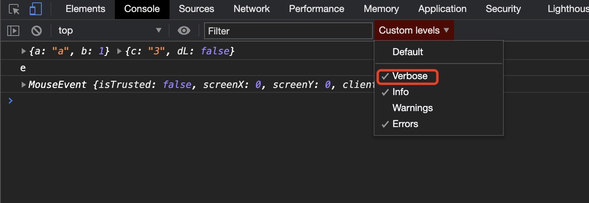
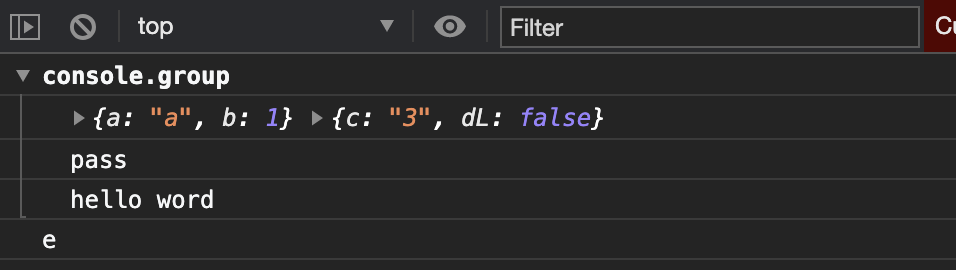
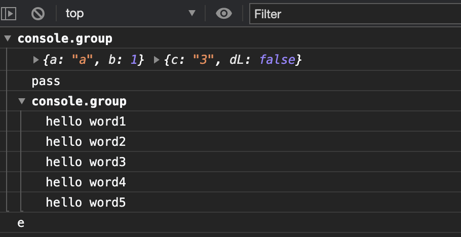
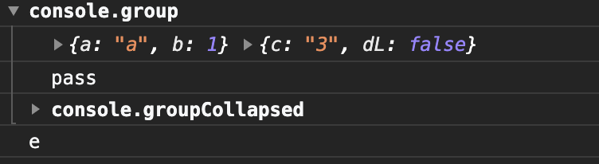
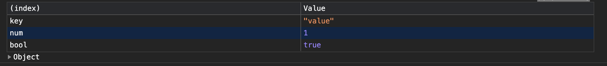
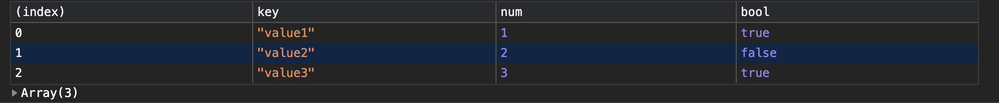
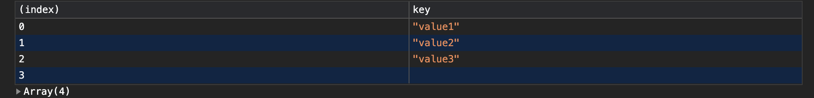
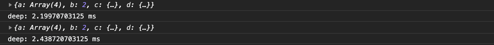
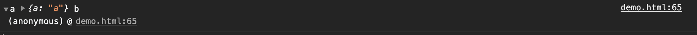

# BOM

```BOM```(```Browser Object Model```), 浏览器对象模型, 提供了与浏览器窗口交互的接口;  
属于```WebApi```一部分;

## ```window```

  表示一个包含文档的窗口, 暴露给```Javascript```代码.  
  并保存了所有的```WebApi```,并且是当前窗口的全局对象.

## 常用```BOM```接口

+ [DOM](./DOM);
+ ```Console```: 控制台;
  方法:  
  + ```log```: 向控制台输出日志;
  + ```error```: 向控制台输出```错误```级别信息;
  + ```warn```: 向控制台输出```警告```级别信息;
  + ```debug```: 输出```调试```级别的消息。
  需要勾选```Verbose```才会显示:
  
  + ```assert```: 如果断言为false，则将一个错误消息写入控制台。如果断言是 true，没有任何反应。

  ```JavaScript
    const a = 1
    console.assert(true);
    console.assert(a === 1);
  ```

  当断言为```false```时输出:
  > 报错文件名: 报错行数 Assertion failed: console.assert
  + ```group```: 创建输出分组, 随后输出到控制台上的内容都会被添加一个缩进,表示该内容属于当前分组,直到调用```console.groupEnd()```之后,当前分组结束.  
  示例:  
  
  ```JavaScript
    console.group();
      console.debug({a: "a",b: 1}, {c: "3", dL: false});
      console.log("pass");
      console.log("hello word");
    console.groupEnd();
    console.log("e");
  ```
  
  输出结果:
  

  也可以进行多层嵌套:

  ```JavaScript
  console.group();
    console.debug({a: "a",b: 1}, {c: "3", dL: false});
    console.log("pass");
    console.group();
      console.log("hello word1");
      console.log("hello word2");
      console.log("hello word3");
      console.log("hello word4");
      console.log("hello word5");
    console.groupEnd();
  console.groupEnd();
  console.log("e");
  ```

  输出结果
  
  + ```groupCollapsed```: 与```group```用法相同, 但是打印出来的结果默认是收起的;

  ```JavaScript
  console.group();
    console.debug({a: "a",b: 1}, {c: "3", dL: false});
    console.log("pass");
    console.groupCollapsed();
      console.log("hello word1");
      console.log("hello word2");
      console.log("hello word3");
      console.log("hello word4");
      console.log("hello word5");
    console.groupEnd();
  console.groupEnd();
  console.log("e");
  ```

  

  + ```table```: 将数据以表格的形式显示.
  第一个参数必须为```对象```或者```数组```:

  ```JavaScript
    const test = {
      key: "value",
      num: 1,
      bool: true
    };
    console.table(test);
  ```

  

  ```javaScript
    const test = [
      {
        key: "value1",
        num: 1,
        bool: true
      },
      {
        key: "value2",
        num: 2,
        bool: false
      },
      {
        key: "value3",
        num: 3,
        bool: true
      }
    ];
    console.table(test);
  ```

  

  如果第一个参数是数组嵌套对象的话, 可以使用第二个参数```columns```,可以选择要显示的```key```:

  ```JavaScript
  const test = [
      {
        key: "value1",
        num: 1,
        bool: true
      },
      {
        key: "value2",
        num: 2,
        bool: false
      },
      {
        key: "value3",
        num: 3,
        bool: true
      },
      {
        num: 4,
        bool: true
      },
    ];
    console.table(test, ["key"]);
  ```

  

  + ```time```: 启动一个计时器, 常用于跟踪某个操作所用的时长;
  
  ```JavaScript
    console.time("deep"); // 计时开始,参数为计时器标识;

    // deepClone是一个深拷贝方法, 用来测试console.time
    console.log(deepClone(ex));
    
    console.timeLog("deep"); // 输出一个计时器的值,参数为计时器标识;
    
    console.log(deepClone(ex));
    
    console.timeEnd("deep"); // 结束计时, 参数为计时器标识;
  ```

  

  + ```trace```: 向控制台输出一个堆栈跟踪;
  参数与```log```相同:

  ```JavaScript
  const test = "a";
  const test1 = {a: "a"};
  console.trace(test, test1, "b");
  ```

  

  + [```console```的方法支持```printf```的```占位符```格式](https://juejin.cn/post/6844904023183769607)

+ ```History```: 历史记录;
+ ```Location```
+ ```WebGL```
+ ```OffscreenCanvas```: 提供了一个可以脱离屏幕渲染的```canvas```对象,它在窗口环境和```web worker```环境均有效.**实验中的功能**
+ ```OfflineAudioContext```: 不在硬件设备渲染音频;相反,它尽可能快地生成音频,输出一个 ```AudioBuffer``` 作为结果.
+ ```WaveShaperNode```: 表示一个非线性的畸变器, 是一个使用曲线来将一个波形畸变应用到一个声音信号中的```AudioNode```. 除了明显的失真效果之外, 它通常用来给信号添加一个暖调的感觉.
+ ```Performance```: 可以获取到一些和性能有关的信息;
+ ```Screen```: 表示一个屏幕窗口, 往往指的是当前正在被渲染的```window```对象, 可以使用 ```window.screen``` 获取它.
+ ```ScrollToOptions```: 元素或```window```滚动对象,可以获取当前滚动位置或者设置滚动到某个位置;
+ 数据缓存```Storage```
  + ```sessionStorage```
  + ```localStorage```
  + ```History.pushState()```
  + ```IndexDB```: 用于存储大量的结构化数据, 存储大量数据的方法还有```webSQL```;
  + ```cache```: 缓存请求及响应数据;
+ ```CSS```
+ ```Blob```
+ ```File```
+ ```Navigator```: 保存了一些浏览器的信息;
+ ```PublicKeyCredential```: 网络加密, 仅支持```HTTPS```协议;
+ 硬件:
  + 蓝牙
  + 各种传感器
  + USB: **实验中的功能**
