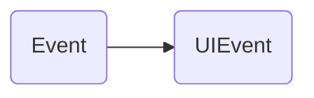
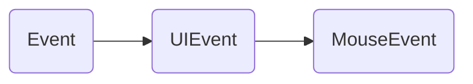
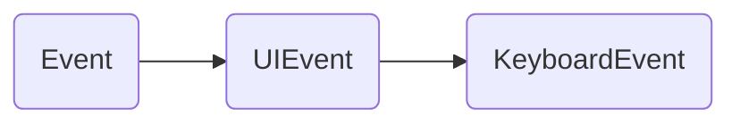
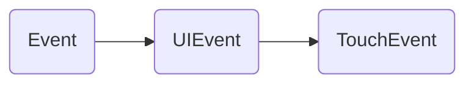
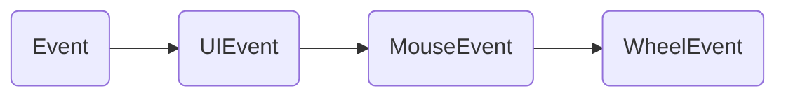

# 事件```Event```

某些行为会触发事件, 事件被触发后可以使用```Event```接口中的方法进行监听.如: ```EventTarget.addEventListener()```... ... ;

## 自定义事件

开发者也可以自定义一些事件:  

```JavaScript
/**
 * typeArg: 事件名, DOMString(普通字符串就行).
 * eventOptions: {
    bubbles: 可选，Boolean类型，默认值为 false，表示该事件是否冒泡;
    cancelable: 可选，Boolean类型，默认值为 false， 表示该事件能否被取消;
    composed: 可选，Boolean类型，默认值为 false，指示事件是否会在元素阴影位置触发侦听器。阴影指css中box-shadow
    }
  */
const typeArg = "test";
const eventOptions = {
  bubbles: false,
  cancelable: false,
  composed: false
}
const myEvent = new Event(typeArg, eventOptions); // 定义事件
EventTarget.addEventListener(typeArg, e => {
  console.log(e);
}); // 监听事件
EventTarget.dispatchEvent(myEvent); // 触发事件
```

事件还可以通过一些方法主动触发, 例如:

```JavaScript
  const testDom = document.getElementById("test");
  testDom.addEventListener("click", (e) => {
    console.log("e");
    console.log(e);
  })
  testDom.click();
```

可以通过```EventTarget.removeEventListener();```移除事件监听;

## 事件对象

事件处理函数的参数被称为事件对象, 可以用来获取事件元素相关的属性,并提供与事件元素相关的方法;

`Event`: `DOM`中出现的事件;

`UIEvent`: 用户界面中出现的事件;

继承关系:



`MouseEvent`: 由指针设备(如`鼠标`)触发的事件,会有一些和元素与触发位置相关的属性和方法:  

继承关系:



`KeyboardEvent`: 由键盘输入触发的事件, 每个事件都描述了用户与一个按键或一个按键与一个修饰键的组合的交互:

继承关系:



`DataTransfer`: 由用户的拖拽行为触发的事件, 可以获取当前选定的拖拽的源与目标位置的属性和方法:

//TODO 未确认`DataTransfer`对象是否继承自其他事件对象

`TouchEvent`: 由用户触摸行为触发的事件, 会有一些和元素与触发位置相关的属性和方法:

继承关系:



`WheelEvent`: 由鼠标滚轮滚动触发的事件, 保存了一些滚轮操作的值:

继承关系:



`ScrollEvent`: 由页面滚动触发的事件, 保存了一些页面滚动的值:

//TODO 未确认`ScrollEvent`对象是否继承自其他事件对象

## 冒泡与捕获

## 事件移除
