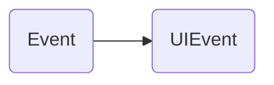
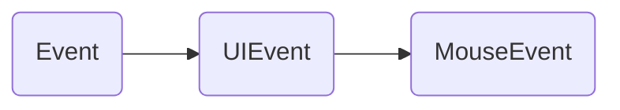
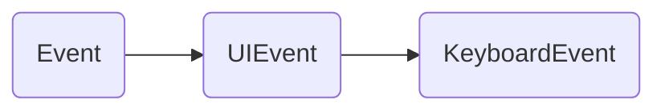
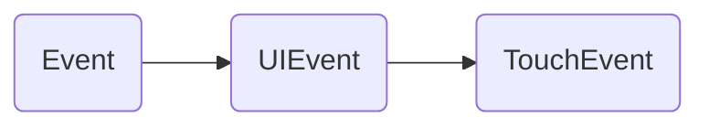
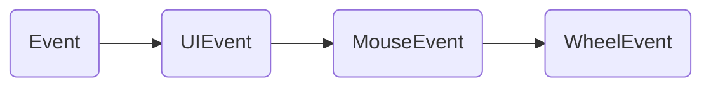
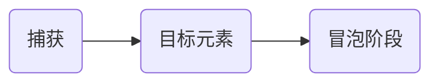

# 事件```Event```

某些行为会触发事件, 事件被触发后可以使用```Event```接口中的方法进行监听.如: ```EventTarget.addEventListener()```... ... ;

## 自定义事件

开发者也可以自定义一些事件:  

```JavaScript
/**
 * typeArg: 事件名, DOMString(普通字符串就行).
 * eventOptions: {
    bubbles: 可选，Boolean类型，默认值为 false，表示该事件是否冒泡;
    cancelable: 可选，Boolean类型，默认值为 false， 表示该事件能否被取消;
    composed: 可选，Boolean类型，默认值为 false，指示事件是否会在元素阴影位置触发侦听器。阴影指css中box-shadow
    }
  */
const typeArg = "test";
const eventOptions = {
  bubbles: false,
  cancelable: false,
  composed: false
}
const myEvent = new Event(typeArg, eventOptions); // 定义事件
EventTarget.addEventListener(typeArg, e => {
  console.log(e);
}); // 监听事件
EventTarget.dispatchEvent(myEvent); // 触发事件
```

事件还可以通过一些方法主动触发, 例如:

```JavaScript
  const testDom = document.getElementById("test");
  testDom.addEventListener("click", (e) => {
    console.log("e");
    console.log(e);
  })
  testDom.click();
```

可以通过```EventTarget.removeEventListener();```移除事件监听;

## 事件对象

事件处理函数的参数被称为事件对象, 可以用来获取事件元素相关的属性,并提供与事件元素相关的方法;

`Event`: `DOM`中出现的事件;

+ `bubbles`: 表示该事件是否会冒泡, 只读属性;
+ `cancelBubble`: 在事件处理器函数`return`之前,将这个属性设为`true`可以阻止事件冒泡;
+ `cancelable`: 表示事件是否可以取消, 只读属性;
+ `composed`: 一个布尔值，表示事件是否可以穿过 Shadow DOM 和常规 DOM 之间的隔阂进行冒泡;
+ `deepPath`: 一个由事件流所经过的 DOM 节点组成的数组.
+ `currentTarget`: 对当前事件注册目标的引用.
+ `target`: 对事件原始目标的引用，这里的原始目标指最初触发事件时指定的目标.
+ `preventDefault()`: 取消事件;
+ `stopPropagation()`: 停止冒泡;

`UIEvent`: 用户界面中出现的事件;

继承关系:



+ `altKey`: 当鼠标事件触发的时，如果`alt`键被按下，返回`true`;
+ `ctrlKey`: 当鼠标事件触发时，如果 `control` 键被按下，则返回 `true`.
+ `cancelBubble`: 表示该事件冒泡是否被取消.
+ `isChar`: 表示该事件是否产生一个键盘字符.
+ `layerX & layerY`: 返回事件相对于当前层的坐标, 如定位元素中是相对于最内层定位元素左上角的坐标.
+ `pageX & pageY`: 返回事件相对于当前文档的垂直坐标.
+ `which`: 返回返回一个对应键盘按下的数字类型的`keyCode`, 或者一个字母数字键按下时的字符码.

`MouseEvent`: 由指针设备(如`鼠标`)触发的事件,会有一些和元素与触发位置相关的属性和方法:  

继承关系:



+ `button`: 当鼠标事件触发的时，如果鼠标按钮被按下（如果有的话），将会返回一个数值。
+ `buttons`: 当鼠标事件触发的时，如果多个鼠标按钮被按下（如果有的话），将会返回一个或者多个代表鼠标按钮的数字。
+ `clientX & clientY`: 鼠标指针在点击元素中的坐标.
+ `offsetX & offsetY`: 鼠标指针相对于目标节点内边位置的坐标。
+ `screenX & screenY`: 鼠标指针相对于屏幕的坐标.
+ `which`: 当鼠标事件触发时, 表示被按下的按钮.

`KeyboardEvent`: 由键盘输入触发的事件, 每个事件都描述了用户与一个按键或一个按键与一个修饰键的组合的交互:

继承关系:



+ `code`: 返回一个值代表触发事件的物理按键。
+ `key`: 返回一个值表示的键的键值

`TouchEvent`: 由用户触摸行为触发的事件, 会有一些和元素与触发位置相关的属性和方法:

继承关系:



+ `changedTouches`: 一个 `TouchList` 对象, 包含了代表所有从上一次触摸事件到此次事件过程中, 状态发生了改变的触点的 `Touch` 对象.
+ `targetTouches`: 一个 `TouchList` 对象,是包含了如下触点的 `Touch` 对象:触摸起始于当前事件的目标元素上,并且仍然没有离开触摸平面的触点.
+ `touches`: 一 个 `TouchList` 对象，包含了所有当前接触触摸平面的触点的 `Touch` 对象，无论它们的起始于哪个元素上，也无论它们状态是否发生了变化。

`WheelEvent`: 由鼠标滚轮滚动触发的事件, 保存了一些滚轮操作的值:

继承关系:



+ `deltaX && deltaY && deltaZ`: 该值表示滚轮的滚动量.
+ `deltaMode`: 该值表示上述各`delta*`的值的单位, `0`表示滚动量单位为像素,`1`表示滚动单位为行, `2`表示滚动单位为页.

`ScrollEvent`: 由页面滚动触发的事件, 保存了一些页面滚动的值:


事件对象本身并没有特有属性,但是通过`window.scrollY`与`window.scrollX`可以获取当前滚动的位置.

## 冒泡与捕获

`DOM2`中事件流包括三个阶段:  



+ 捕获阶段: 从文档最外层向目标元素逐层触发事件;
+ 目标元素: 触发目标元素事件;
+ 冒泡阶段: 从目标元素向文档最外层逐层触发事件;
