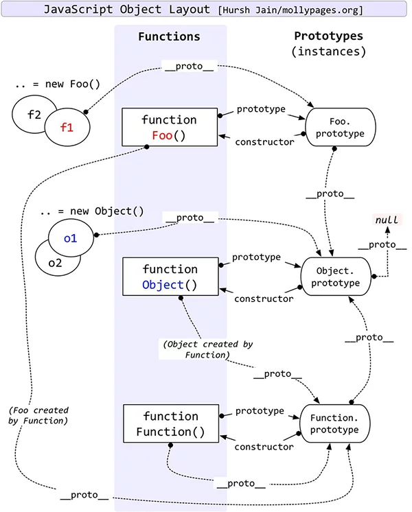
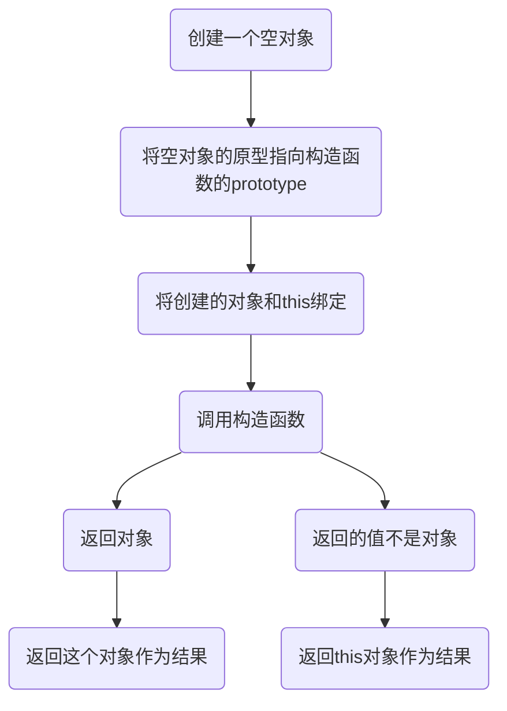

# 对象原型

通过原型这种机制,`JavaScript`中的对象从其他对象继承功能特性;

## `__proto__` & `prototype`

对象通过`__proto__`获取到原型对象,在最新版的标准中`__proto__`已被废弃,通过`[["prototype"]]`与`Object.getPrototypeOf()`代替.
`[["prototype"]]`会影响性能,并且还会影响所有继承自这个`[["prototype"]]`的对象,所以推荐使用`Object.getPrototypeOf()`.
现在部分浏览器对`[["prototype"]]`与`Object.getPrototypeOf()`并不支持,所以并不推荐使用.

`__proto__`指向它构造函数的`prototype`,并且每个对象都有一个`__proto__`,每个函数都有一个`prototype`属性.
箭头函数没有`prototype`属性;
`prototype`中的`constructor`指向构造函数本身, 具体关系参考一张经典的图:



+ `__proto__(隐式原型)`: 指向对象的原型, 每个对象都会有这个属性.但是这个属性并不是`ECMA`标准,但是现代浏览器都实现了它.
每个对象的原型也都是对象, 原型与原型的原型相连接就形成了`原型链`.
获取一个对象的某个属性时,如果对象没有这个属性会向它的原型(`__proto__`)中去找,然后顺着原型链逐层向上找到`Object`中;
+ `prototype(显式原型)`: `JavaScript`中函数`Function`可以拥有属性, 使用`function`关键字声明的函数都有一个`prototype`属性,但是箭头函数没有`prototype`属性;
+ `constructor(构造函数)`: 顾名思义,就是构造当前对象的函数.通过`obj.__proto__.constructor`可以访问到当前对象的构造函数, 函数的`prototype.constructor`指向函数本身;

## new

`new` 运算符创建一个用户定义的对象类型的实例或具有构造函数的内置对象的实例.

+ new做了什么?



+ 怎样实现一个new

实现一个`new`就是把`new`做的事做一遍,如:

```javaScript
  /**
   * 因为new是一个关键字,而js不能创建关键字.所以,通过函数的方式创建;
   * 并且
   */
  const createObj = function (cur, ...arg) {
    const obj = {}; // 创建一个空对象
    obj.__proto__ = cur.prototype; // 将空对象的原型指向构造函数的prototype
    const result = cur.apply(obj, arg); // 将创建的对象和this绑定,并调用构造函数
    if(typeof result === "object" || typeof result === "function") {// 判断构造函数返回值
      return result; // 如果是对象,就返回这个对象作为结果
    }else {
      return obj; // 如果不是对象, 返回this作为结果.因为this指向了obj,所以返回obj;
    }
  }
```

+ 构造函数

+ class

+ 使用 new的方式

## 继承
