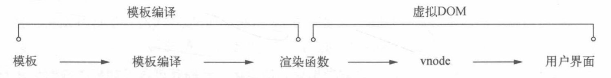

# vue原理简介

## 变化侦测

应用在运行过程中, 内部状态是在不断的改变的.所以需要侦测到状态的变化, 并及时根据状态的修改及时更新;
通常变化侦测有两种方案:

+ 推: 状态发生改变时, 会主动通知依赖他的方法.`推`的方案会告诉依赖更多的信息, 所以可以进行更细粒度的更新;
  但是,细粒度的监听会占用大量内存;
+ 拉: 状态发生改变时依赖它的方法只能获取到有状态发生改变, 但是并不知道具体是哪一个状态发生了改变;
  监听到状态改变后再进行对比, 找到两次状态间的差异并进行更新;

`vue`中采用的是`推`的方法, 因为细粒度的监听会占用内存.所以`vue`的状态不再绑定`DOM`节点, 而是组件;

`vue`实例监听到状态改变后, 会通知到组件.组件内部再进行一次比对, 这样可以降低侦测的力度从而节省大量内存;

## vue侦测变化的方法

通过`Object.defineProperty`侦测到对象的变化,然后在`setter`中更新依赖;
每个状态都可能会有很多地方去依赖, 所以需要在`getter`中收集依赖,然后在`setter`中去更新;
`vue`中的依赖就是-监听器`watcher`, 依赖更新时会去通知`watcher`, 然后它再去通知其他地方;
`vue`中定义了一个`Observe`类,用来将一个对象转为可以被侦测的`object`;
`vue`会调用`Observe`转换`data`中所有的属性;

因为变化侦测是通过`Object.defineProperty`来实现的, 所以当对象的属性值发生改变的时候`vue`是侦测不到这种变化的.
可通过显式的使用`vm.$set()`来通知vue实例, 或者通过`vm.$forceUpdate()`强制`vue实例`重新渲染;

### 侦听数组的变化

因为无法侦测到数组内部的增加或删除, 所以`vue`使用一个拦截器来覆盖`Array.prototype`.每当使用`Array`原型上的方法修改数组时, 执行的都是拦截器中的方法;
拦截器中的方法执行时会通知这个数组的依赖, 而`vue`中数组的依赖收集同样是在`getter`中收集;
所有方法中数组的变化都是通过拦截器来进行监听的;

### 变化侦测相关的方法实现

+ vm.$watch: 是一种对监听器`watcher`的封装;
+ vm.$set: `Observe`类抛出的set方法;

## 虚拟DOM(Virtual DOM)

因为频繁操作`DOM`修改的代价很大, 所以采用`虚拟DOM`来比对更新前后的差异, 从而减少`DOM`的操作;
`Angular`和`React`都采用了全部比对的方式, 而`vue`在状态更新时会检测到组件级的变化, 所以`vue`只需要比对单个组件的`虚拟DOM`;
`虚拟DOM`只是一种用来描述`DOM`的`JavaScript`对象, 操作对象会比操作`DOM`更节省资源;

### patching算法

`vue`在更新`DOM`的时候并不会直接覆盖原有`DOM`节点, `patching算法`会通过`虚拟DOM`来比对新旧节点的差异从而找出需要更新的节点;
对比出新旧节点之间的差异后, 除删除、新增之外需要更新的节点不会被删除, 而是根据比对出的差异来修改原节点.

## 模板编译原理

`vue`提供了模板语法, 可以声明式的描述`DOM`与状态之间的关系.
但是模板最终也要生成`虚拟DOM`, 并渲染为真实`DOM`呈现给用户;

`vue`会通过模板生成渲染函数, 再将渲染函数生成为`VNode`(虚拟节点),通过`VNode`组合成`虚拟DOM`, 最终渲染到页面上;

+ 模板: 用来描述了`DOM`与状态之间关系;
+ 渲染函数: 用来在状态更新后生成`VNode`;

模板编译过程为渲染函数分为两步:

+ 将模板编译为`AST`;
+ 使用`AST`生成渲染函数;

因为有些节点没有与状态绑定, 不需要重复渲染.所以在生成渲染函数时会先遍历一次`AST`, 将那些节点标记为静态节点;

## 自定义事件原理

`vm.$on`会将事件存储到`vm._events`中, 存储时用`事件名`做`key`,`事件回调`会被`push`到一个数组中作为属性值`value`;
`vm.$emit`调用时会根据对应的`事件名`执行`vm._events`中的方法;

`vm.$off`可以根据传参的不同移除不同的事件监听或者清空所有事件;

## 生命周期函数

生命周期钩子函数是在`vue`运行过程中不同阶段被`callHook`函数调用的`vue`实例上的方法.
